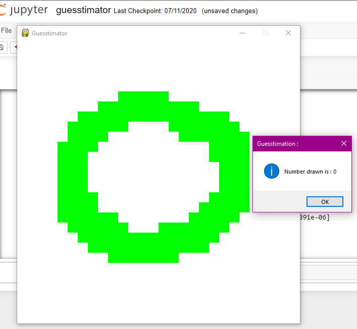
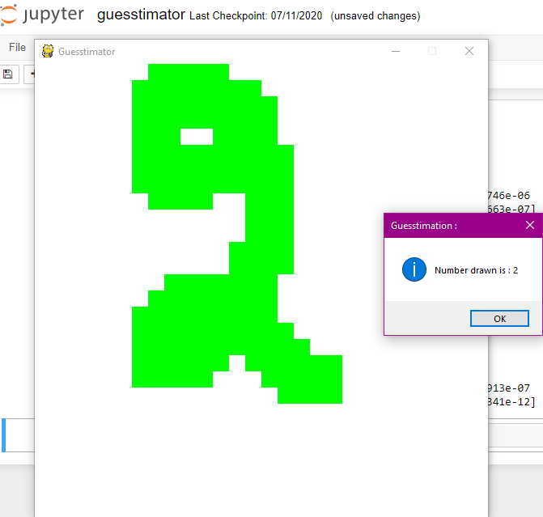
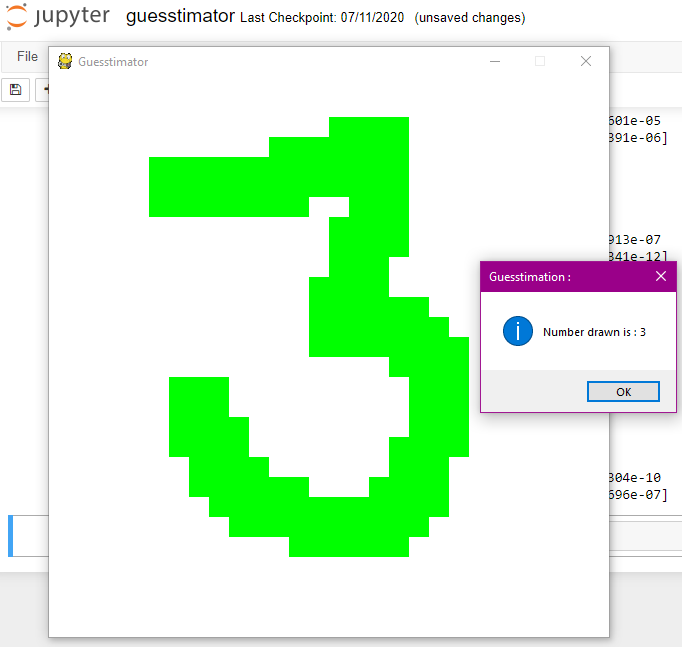
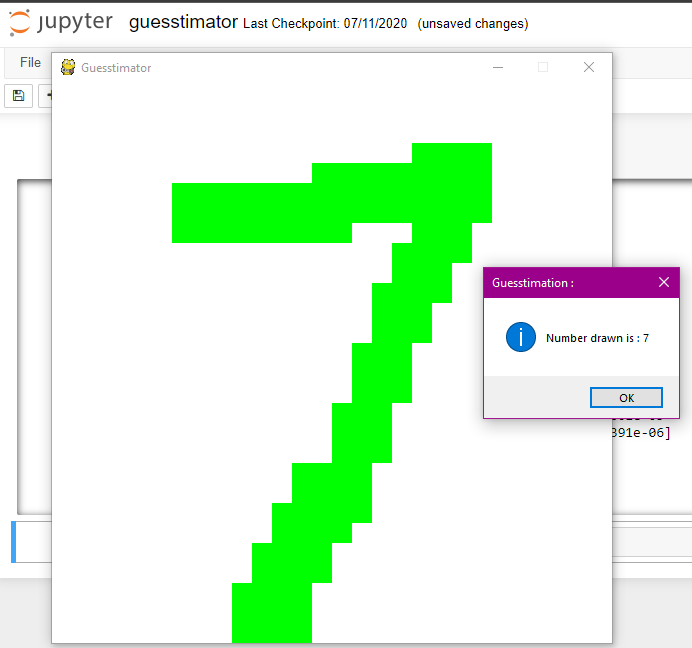
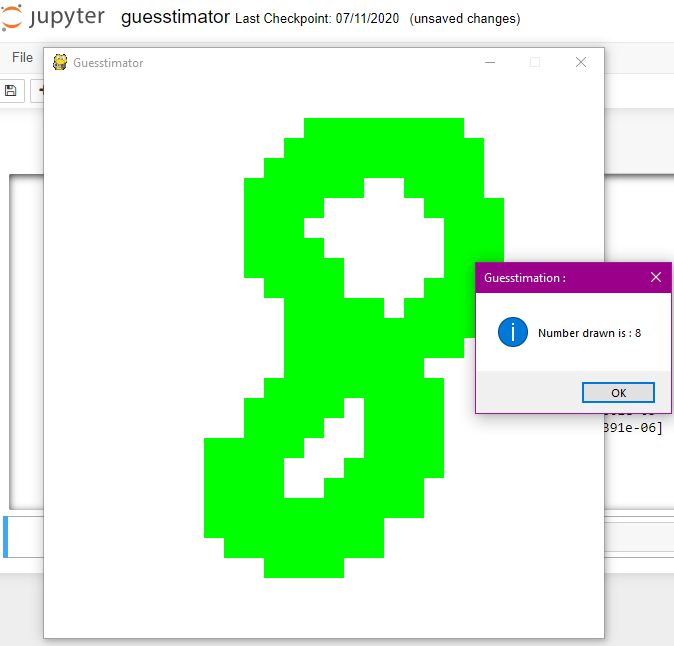

# Guesstimator
A digit recognizer window.

A pygame implementation of a Digit Recognizer which allows the user to draw a number on the screen. Then pixels are generated from the screen which further fed into the neural network model and predicts which number is drawn based on the MNIST dataset.

## Dependencies
- pygame
- keras
- numpy
- tensorflow
- tkinter
- matplotlib

&nbsp;
## How to Run ?
- download the ```guesstimator.ipynb``` file.
- install all the dependencies.
- run the file in Jupyter Notebook.
- draw any number on the pop-up screen and see the prediction.

## Some other points
- MNIST dataset is used to train the model.
- Drawing the number on the screen is done through pygame.

&nbsp;

## Screenshots
  \t    \t  

&nbsp;
  \t  
